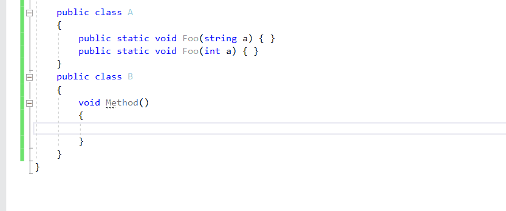

# PaSharper-Extensions

### Disclaimer:

Данный проект не несет никакой общественной ценности. Он создан лишь для того, чтобы понять, как писать плагины для решарпера и разобраться в тонкостях работы синтаксического анализатора. Идеи для каждого анализаторы были рождены в муках во время основной работы

## Char instead of Int

Данный анализатор позволяет избежать случайного использования неверного метода, если есть перегрузки методов с int и string, а ошибочно передается char

## Neccessary await

Анализатор подсказывает, что возвращать Task из функции не самая лучшая идея, если объект, у которого метод возвращает этот Task создается внутри стейтмента using. В таком случае (без await) внешняя асинхронная функция может не дождаться выполнения таска, а объект уже будет задиспоужен.

## Possible Null Coalescing Assignment

А этот анализатор помогает заменить блок if с проверкой на null на оператор ??=.
На самом деле такая фича в решарпере уже есть, но я ее просто не заметил. Зато понял, каким образом можно определить, поддерживает ли проект ту или иную версию языка.

## HttpClient Method Call

Уже и не счесть, сколько раз я наступал на подобные грабли. Анализатор показывает, какой же url будет вызван HttpClient'ом после манипуляций с базовым адресом и нужным методом. В амках работы над ним я учился рисовать InlayHints и добавлять настройки в общие настройки решарпера.

На этой гифке показана ранняя версия анализатора, объясняющая его суть.

Так же плагин имеет возможность небольшой навигации (перейти к объявлению переменных или открыть получившийся url в браузере)

Анализатор так же умеет работать не только с локальным переменными функции, но и с константами.

Так же эксперименты со стилями подсказок привели меня к вот такому окончательному варианту. По-моему, выглядит неплохо. Подсказка будто является частью кода.

Ну и нарисовал себе мааааленькую менюшку в общих настройках для изменения визибилити подсказок

